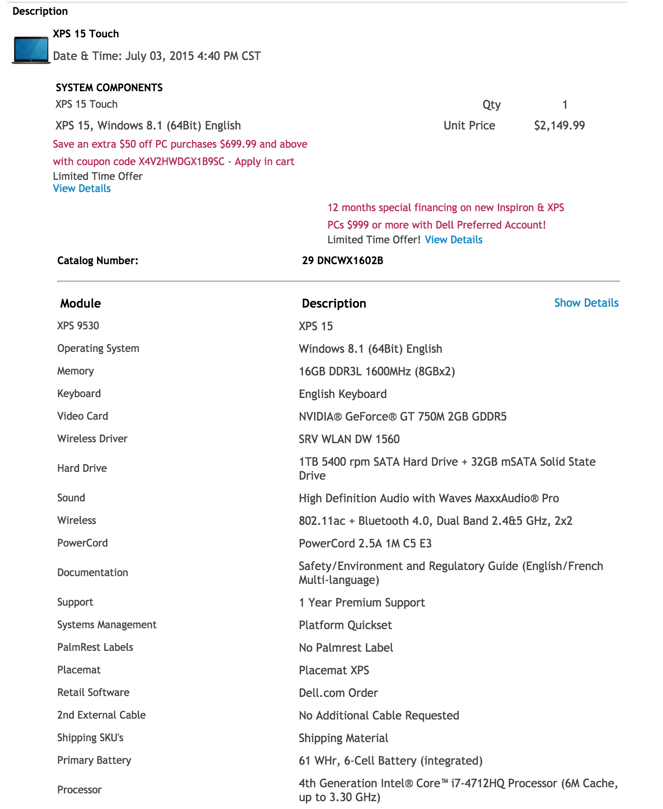

# OS X and Windows

###### Image from http://windows8.iyogi.com/news/windows-8-1-professional-or-os-x-mavericks.html

I've been a Windows user for most of my life. My family's first desktop came equipped with Windows NT, and I guess we saw very little reason to try an Apple machine. My family was also not wealthy by any means and I'm sure Apple machines were very unaffordable in my home country. I always looked at Apple products as luxury and overpriced gadgets. I could do everything I needed to do on my Windows-based machine just fine. I was, and still am, a huge gamer, so a Windows machine is a no-brainer for someone like me. 

However, getting into the software development field, I found myself hard pressed not to try a Linux OS. Most, if not all, of the homework and projects in my CS classes were taught and expected to be worked on the school's Unix server. I was not a solely a gamer anymore, I had other needs. And that's the thing: Windows was no longer enough for my needs. I needed to dive deep into the Unix/Linux ecosystem and learn to use it if I wanted to become a competent software engineer.

## My first Linux experience

Like many other students, my first Linux distro was Ubuntu. It is the best known and most user and newbie-friendly of all Linux flavors. I installed it on a Lenovo ultrabook rocking an i5-4200U and maybe 4gb of RAM. It had an aluminum body and a touch screen which didn't really work well on Ubuntu. This was the first time I really saw the terminal as a tool rather than just another step in the homework. I fell in love with how efficient and versatile the terminal was and quickly learned all the easy commands such as file and directory navigation and rudimentary vim commands. However, the number of polished applications was underwhelming. Most applications felt like hacks and were very poorly designed. I understand that this is the "charm" of Linux for some Linux believers, but it just wasn't enough for me. The battery life was also not stellar on the Lenovo ultrabook; right about this time I enrolled in a Software Engineering class and found myself coding more and away from an outlet. It was also right about this time when I worked with a good friend of mine who owned a Retina Macbook Pro.

## The Retina Macbook Pro

Up until this point, I was part of the "Apple hate" hivemind; I thought Apple products were overpriced and simply bought for their looks. I have come to realize that the former is not always the case, and the latter is not even a bad thing! The Retina Macbook Pros start at $1299 in the Apple store. This is the most basic machine they offer in this form factor, with 13-inch retina screen, an i5 clocked at 2.7GHz, 8GB of DDR3 memory, a 128GB (!) SSD storage, and integrated Intel Iris 6100 graphics card. Now, I have to admit that the price for this particular base model is definitely not worth it. At that price point, I would expect at **least** a 256GB SSD. Not according to Apple, though; if you're looking to bump the SSD to 256GB, that will be a $200 premium. And if you feel like you need a bigger screen than a 13", the cheapest 15" Retina Macbook Pro starts at $1999. But wait a minute... The 15" rMBP base model is configured with an i7 clocked at 2.2GHz, 16GB of memory, and a 256GB SSD. 

## The Alternatives

A 15 minute research on Google unveiled Dell and Lenovo as the two brands I'd most likely go with for a workstation. Their build quality is comparable to Apple's overpriced junk. First, I searched for Lenovo's famous W line of laptops, known for their robustness and performance. Now, to keep the comparison fair and unbiased, all prices shown will be pre-coupons or discounts. Some of you may think this is unfair given that Apple generally does not have much of a discount compared to Lenovo and Dell, who both have very generous discounts multiple times a year. However, not every customer takes advantages of these sales, and I want to keep the comparisons simple to digest. 

Here's what a similarly configured Lenovo W550s costs:

And a similarly configured Dell XPS 15,

The above XPS 15 has a 1TB mechanical drive. Swapping it out for a 512GB SSD bumps the price:

## Conclusion

The numbers don't lie. You are definitely paying a hefty premium for the base Retina Macbook Pro, but as you go up the ladder of rMBPs, the cost becomes more and more justified. Specifically, the 15 inch rMBPs are well worth the money. A similarly configured Dell or Lenovo will run you just as much, or more, as the rMBP. Furthermore, the battery life on the Macbook Pros has been proven to be one of the best, if not the best, in the market. While the Dell and Lenovo laptops claim a similar battery life, I honestly simply trust Apple's estimate more. 

Now, as a developer, I see real value in being in the Apple ecosystem. The developer community that uses Apple products is huge. Everyone at my workplace uses a Macbook. The Apple believers say that "it just works," and I thought that that was a lame argument for Apple. But I've come to appreciate that. The applications are beautiful, the experience is great, and developing on my Retina Macbook Pro has been a delight. I can confidently say that I am a better developer having moved from Windows to OS X for development.

It is also much easier to boot up Windows on a Mac machine (thanks to Bootcamp) than it is for a Windows machine to run OS X. At this point in my life, I see no reason to use a Windows laptop as my daily driver. As a gamer, however, I've tried playing games on my rMBP and while possible, with the old-generation GT750M in it, it is not very enjoyable. 

###### All prices were compiled on July 3, 2015.

